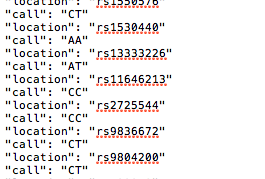
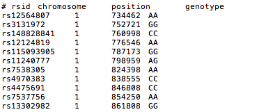

**Algorithm Specs:**

Supplement recommendation is determined by:

Genetics
Lifestyle questionnaire

**Databases Needed:**
-   Prevalence
-   Online variable (for Pooled OR)
-   Disease genetics  [https://docs.google.com/spreadsheets/d/1D3nc2CITd71JmlaGbcHj8yaEcv_ZLvSkr3qT4TkVJS8/edit?usp=sharing](https://www.google.com/url?q=https://docs.google.com/spreadsheets/d/1D3nc2CITd71JmlaGbcHj8yaEcv_ZLvSkr3qT4TkVJS8/edit?usp%3Dsharing&sa=D&source=editors&ust=1712789321007117&usg=AOvVaw0CHJRntoPlX3RljQtstiNA)
	-   SNP
	-   GeneName
	-   Genotype
	-   DiseaseName
	-   Gender
	-   Ethnicity
	-   OR

-   Supplement Reference Database
	-   SupplementName
	-   Disease
	-   Dosage
	-   Average Score

-   Vitagene Supplements
	-   SupplementName
	-   Dosage

-   Contraindications (will provide later)
-   Nutrient Depletions (will provide later)

**Genetic Module:**

-   Read user's DNA (SNP/genotype)

-   available in 2 formats:\
    

        
-   Based on the user's DNA, look into the pooled OR
	-   (Age and sex can be grabbed from our user DB)
	-   every disease is populated with a pooled OR
	-   CT and TC are the same- order of genotype is irrelevant. **(check on this already being handled)**
	-   output: every disease's pooled OR over 1.0
-   Each disease from above output is matched in the supplement
    reference database
	-   output: supplements, dosage, disease
	-   If the supplement shows up twice in the output, take the higher dosage
**Lifestyle Module:**
	- Read user's DNA (SNP/genotype)